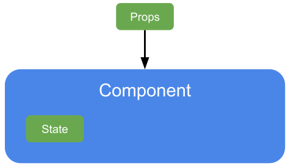
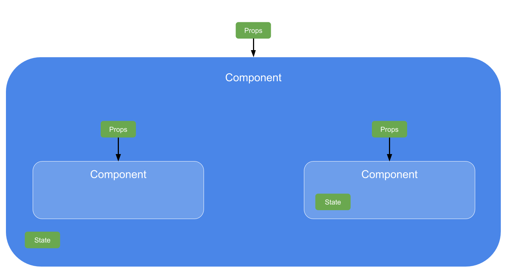
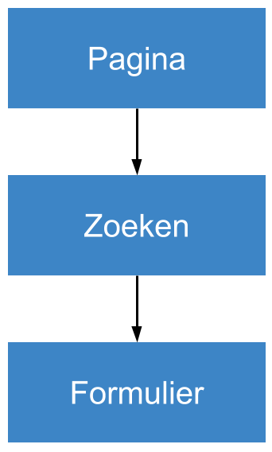

import { LiveCode } from 'mdx-deck-live-code';
import { Head, Appear, Image } from 'mdx-deck';

<Head>
  <title>Workshop introductie React</title>
  <style>
    {`[title="Previous Slide"],
    [title="Next Slide"] {
      display: none;
    }`}
  </style>
</Head>

# Workshop introductie React

---
    
## Wat leer je in deze workshop?
- De basisprincipes van React.
- Hoe je een nieuw project opzet.
- Handvatten om zelf aan de slag te gaan.

---

## Wat is React?
<Appear>
    <ul>
        <li>A JavaScript library for building user interfaces</li>
    </ul>
</Appear>

---

### Declarative
Declarative views make your code more predictable and easier to debug.

---

### Component-based
Build encapsulated components that manage their own state, then compose them to make complex UIs.

---



---



---

## Rendering
- Componenten doen een rerender wanneer de state (buiten het component) wijzigt.
- Alleen wanneer de output verandert zal een DOM-update plaatsvinden.

---

## Virtual DOM



---

<Image src="./images/virtual-vs-real.png" style={{
    display: 'flex',
    alignItems: 'center',
    justifyContent: 'center',
    backgroundSize: '100vh'
}}></Image>

---

<Image src="./images/virtual-dom-change.png" style={{
    display: 'flex',
    alignItems: 'center',
    justifyContent: 'center',
    backgroundSize: '100vh'
}}></Image>

---

<Image src="./images/dom-result.png" style={{
    display: 'flex',
    alignItems: 'center',
    justifyContent: 'center',
    backgroundSize: '100vh'
}}></Image>

---

## Class vs Functional components (FC)
- Classes hebben `this`
- Classes hebben lifecycle methods, FC hebben hooks
- Iedere class zorgt voor ~ 1kb aan extra transpiled code

---

<LiveCode
  size="large"
  providerProps={{
    noInline: true,
  }}
  title="JSX Syntax"
  code={require('!raw-loader!./examples/react.js')}
/>

```notes
- Prop aanpassen
- Functie verkleinen
```

---

## State
- Data specifiek voor een component
- State kan op ieder moment wijzigen
- Behandel state alsof het immutable is, alleen wijzigen met `setState()`

---

<LiveCode
  size="large"
  providerProps={{
    noInline: true,
  }}
  title="Class components, setState"
  code={require('!raw-loader!./examples/setstate.js')}
/>

---

<LiveCode
  size="large"
  providerProps={{
    noInline: true,
  }}
  title="Functional component, state hook"
  code={require('!raw-loader!./examples/state-hook.js')}
/>

---

## Composition
- Herbruikbaarheid van componenten
- Snel een nieuw display component opzetten
- Werkt met class- en functional components

---

<LiveCode
  size="medium"
  providerProps={{
    noInline: true,
  }}
  title="Children"
  code={require('!raw-loader!./examples/children.js')}
/>

---

<LiveCode
  size="medium"
  providerProps={{
    noInline: true,
  }}
  title="Slots"
  code={require('!raw-loader!./examples/slots.js')}
/>

---

## Zelf aan de slag
### Developers profielschets-tool bouwen
- Vaste lijst met vaardigheden tonen
- Vaardigheden kunnen selecteren uit bestaande lijst
- Eigen vaardigheden kunnen toevoegen & selecteren

---

## Create React app
```
$ npx create-react-app react-workshop
$ cd react-workshop
$ npm start
```

---

## Hoe nu verder?
- State en UI scheiden
- Server side rendering
- Unit tests
- Typescript

---

- Slides: http://remcoaalbregt.github.io/workshop-react-intro
- Repo: https://github.com/remcoaalbregt/workshop-react-intro
